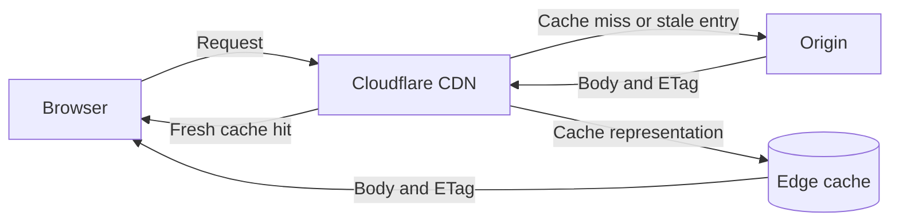
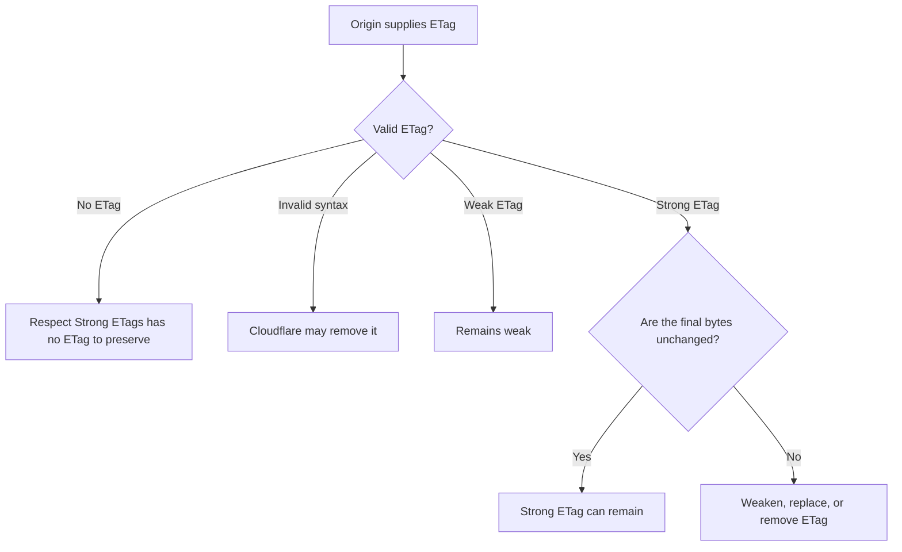
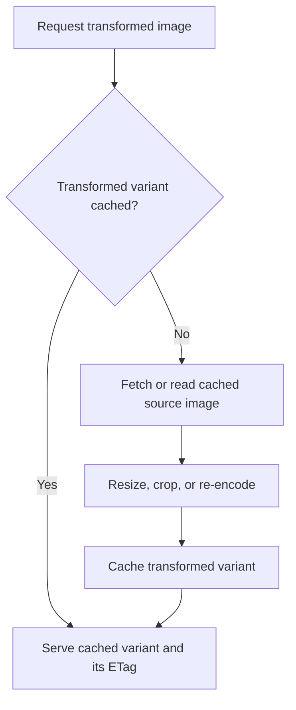
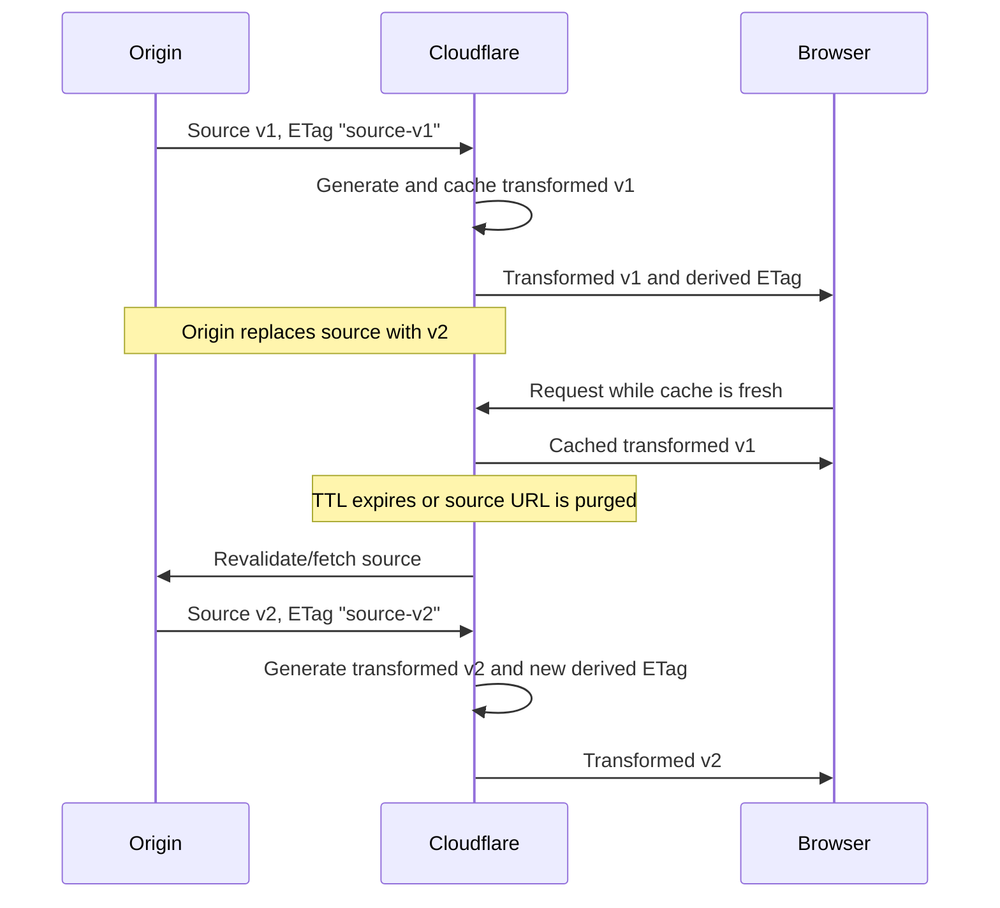
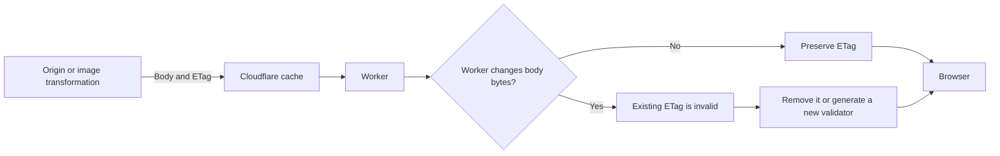

# HTTP ETags with Cloudflare CDN and Image Transformations

## Summary

- A **strong ETag** (`ETag: "v1"`) means the response bytes are identical.
- A **weak ETag** (`ETag: W/"v1"`) means the representations are semantically equivalent, but their bytes may differ.
- `Cache-Control` decides **when** a cached response becomes stale; an ETag helps decide **whether** it changed during revalidation.
- A CDN cache key selects the requested representation. An ETag validates that representation; it is not the cache key.
- **Respect Strong ETags** asks Cloudflare to preserve byte-for-byte validation whenever possible. It does not guarantee that every response has a strong ETag.
- If Cloudflare changes bytes after a strong ETag was assigned—through decompression, recompression, or content rewriting—it must weaken, replace, or remove that ETag.
- Image transformation creates a new representation with a derived ETag. It does not reuse the source image's strong ETag unchanged.
- ETags do not immediately notify Cloudflare about an origin update. TTLs, revalidation, purging, and versioned URLs control when an update becomes visible.

## Relationship between caching and validation



```text
Cache key       -> Which representation should be used?
Cache-Control   -> How long may it be reused without checking?
ETag            -> Is the cached representation still the same version?
Strong ETag     -> Are the bytes exactly identical?
```

On a cache miss, Cloudflare needs the complete response body to populate its cache, so it does not send an ETag validator to the origin. Once a cached entry becomes stale, Cloudflare can use the ETag for conditional revalidation.

## Core ETag decision



Strong ETags must be quoted correctly:

```http
ETag: "file-v1"
```

An unquoted value such as `ETag: file-v1` is invalid, and Cloudflare may remove it instead of converting it to weak.

## Respect Strong ETags: enabled versus disabled
### Cases

<table>
  <thead>
    <tr>
      <th>Origin response</th>
      <th>Cloudflare action</th>
      <th>Respect Strong ETags</th>
      <th>Result</th>
    </tr>
  </thead>
  <tbody>
    <tr>
      <td>Uncompressed with strong ETag</td>
      <td>Delivered unchanged</td>
      <td>On</td>
      <td>Strong ETag preserved</td>
    </tr>
    <tr>
      <td>Uncompressed with strong ETag</td>
      <td>Delivered unchanged</td>
      <td>Off</td>
      <td>Usually preserved if no other feature changes the response</td>
    </tr>
    <tr>
      <td>Gzip, Brotli, or Zstandard with strong ETag</td>
      <td>Same encoding delivered to a compatible client</td>
      <td>On</td>
      <td>Strong ETag preserved</td>
    </tr>
    <tr>
      <td>Gzip or Brotli with strong ETag</td>
      <td>Same encoding delivered to a compatible client</td>
      <td>Off</td>
      <td>Strong ETag can be preserved if conflicting rewrite features are disabled</td>
    </tr>
    <tr>
      <td>Compressed with strong ETag</td>
      <td>Decompressed or recompressed for the client</td>
      <td>On or Off</td>
      <td>ETag becomes weak, is replaced, or is removed because bytes changed</td>
    </tr>
    <tr>
      <td>Uncompressed with strong ETag</td>
      <td>Cloudflare compresses it</td>
      <td>Off</td>
      <td>ETag normally becomes weak because the delivered bytes changed</td>
    </tr>
    <tr>
      <td>Any encoding with strong ETag</td>
      <td>A Cloudflare feature rewrites the content</td>
      <td>Off</td>
      <td>ETag may become weak or be removed</td>
    </tr>
    <tr>
      <td>Any encoding with strong ETag</td>
      <td>A remaining feature still changes content</td>
      <td>On</td>
      <td>The original strong ETag cannot remain valid; it must be weakened, replaced, or removed</td>
    </tr>
    <tr>
      <td>No ETag</td>
      <td>Any unchanged delivery</td>
      <td>On or Off</td>
      <td>Setting has no ETag to preserve; <code>Last-Modified</code> or Smart Edge Revalidation may still be used</td>
    </tr>
    <tr>
      <td>Weak ETag</td>
      <td>Delivered unchanged</td>
      <td>On</td>
      <td>Remains weak; the setting does not upgrade it</td>
    </tr>
    <tr>
      <td>Invalid or unquoted strong ETag</td>
      <td>Any</td>
      <td>On or Off</td>
      <td>Cloudflare may remove the ETag</td>
    </tr>
  </tbody>
</table>

### Enabled

- Cloudflare tries to preserve the exact origin representation and its strong ETag.
- Cloudflare forwards the visitor's `Accept-Encoding` to the origin instead of applying its normal compression override.
- It automatically disables Rocket Loader, Email Obfuscation, and Automatic HTTPS Rewrites for matching requests.
- If an encoding mismatch still forces decompression or recompression, Cloudflare downgrades the validator to weak.
- It does not create an ETag when the origin provides none and does not upgrade a weak ETag.

### Disabled

- Cloudflare can choose and convert content encodings more freely.
- If Brotli is enabled, Cloudflare normally asks the origin for `gzip, br`; otherwise it normally asks for `gzip`.
- It may decompress and recompress a cached response for the visitor, which weakens the ETag.
- A strong ETag can still survive when Cloudflare serves the origin bytes unchanged and no conflicting response-rewrite feature is active.

### Rule of Thumb

```text
Same bytes     -> strong ETag can remain
Changed bytes  -> original strong ETag cannot remain strong
```

### When End-to-end transformations are prohibited

An origin response containing the following prevents Cloudflare from changing compression:

```http
Cache-Control: public, max-age=3600, no-transform
```

- If the origin response is uncompressed, Cloudflare leaves it uncompressed.
- If the origin response is already compressed, Cloudflare preserves that encoding.
- This is the clearer option when the goal is to preserve exact bytes or the origin's `Content-Length`.
- The origin must still select an encoding compatible with the client.

Compression is not the only way bytes can change. Features such as Cloudflare Fonts, Polish, JavaScript detections, RUM, and other response rewrites may require decompression and recompression. Respect Strong ETags automatically disables only the specifically documented conflicting features listed above, not every possible byte-changing feature.

## Image transformations

Cloudflare treats the source image and every transformed result as separate representations.



For example:

```text
/photo.jpg                                      -> original JPEG
/cdn-cgi/image/width=400,format=webp/photo.jpg  -> 400 px WebP
/cdn-cgi/image/width=800,format=avif/photo.jpg  -> 800 px AVIF
```

- Each source-and-parameter combination is cached as a distinct transformed variant.
- Because transformed bytes differ from the source bytes, the source ETag cannot be copied unchanged onto the transformed response.
- Cloudflare assigns a derived ETag to resized output. Its documented form contains Cloudflare-generated information and the source ETag: `cf-<generated-value>:<source-etag>`.
- Changing width, quality, crop, or format produces another representation and validator; it is not merely a weak form of the previous variant.
- `format=auto` can deliver different formats to compatible clients. Each delivered representation must have a validator appropriate to its bytes.

### Does Respect Strong ETags matter for image transformation?

Generally, **not for the transformation operation itself**. It does not control whether Cloudflare transforms an image or how the transformation parameters form a variant.

It can still matter around the pipeline:

- validating or delivering the source image through the normal CDN cache;
- preserving exact bytes when serving a cached transformed response;
- handling any later HTTP content-encoding conversion.

JPEG, PNG, WebP, and AVIF are already compressed image formats, so additional HTTP gzip/Brotli compression is usually not useful. Consequently, compression-driven ETag downgrades are less common for transformed images than for HTML, CSS, or JavaScript.

### Source image changes and invalidation



An ETag is a validator, not an instant invalidation signal:

- While an entry is fresh, Cloudflare may continue serving it without contacting the origin.
- After TTL expiry, revalidation can detect a changed origin ETag.
- To update immediately, purge the full source-image URL; resized variants are associated with that source.
- Prefer versioned URLs such as `/photo.v2.jpg` for long-lived immutable caching.

## Worker modifications after transformation

A Worker can receive an origin or cached response and change it before delivery. **Respect Strong ETags does not automatically repair an ETag after arbitrary Worker code changes the body.**



<table>
  <thead>
    <tr>
      <th>Worker action</th>
      <th>ETag handling</th>
    </tr>
  </thead>
  <tbody>
    <tr>
      <td>Returns body unchanged</td>
      <td>Preserve the ETag</td>
    </tr>
    <tr>
      <td>Changes transformed image or other body bytes</td>
      <td>Remove the existing ETag or generate one for the final output</td>
    </tr>
    <tr>
      <td>Reads or replaces compressed content</td>
      <td>Also remove stale <code>Content-Encoding</code> and <code>Content-Length</code></td>
    </tr>
    <tr>
      <td>Produces personalized content</td>
      <td>Avoid shared caching; normally use <code>Cache-Control: private, no-store</code></td>
    </tr>
  </tbody>
</table>

If the modified output is cached with the Workers Cache API or Workers Cache, its cache key and ETag must cover every output-changing input. Otherwise, an incorrect `304 Not Modified` or the wrong cached variant may be served.

## Practical recommendations

### Configuration rule of thumb

The choice is a trade-off:

```text
ON  -> prioritize byte-exact identity
OFF -> prioritize transformation, recompression, and delivery optimization
```

Apply it selectively by path rather than treating it as a universal zone-wide preference:

<table>
  <thead>
    <tr>
      <th>Path</th>
      <th>Respect Strong ETags</th>
      <th>Reason</th>
    </tr>
  </thead>
  <tbody>
    <tr>
      <td><code>/downloads/*</code></td>
      <td><strong>On</strong></td>
      <td>Exact bytes may matter</td>
    </tr>
    <tr>
      <td><code>/assets/*.js</code> and <code>/assets/*.css</code></td>
      <td><strong>Off</strong></td>
      <td>Allow compression and optimization</td>
    </tr>
    <tr>
      <td><code>/images/*</code></td>
      <td>Usually unnecessary specifically for transformations</td>
      <td>Transformations create separate representations and derived ETags</td>
    </tr>
  </tbody>
</table>

### Additional Guidelines

1. Generate correctly quoted, content-based strong ETags at the origin.
2. Use versioned URLs for immutable static files and images whenever possible.
3. Set deliberate browser and edge TTLs; do not expect ETags to override freshness.
4. Use `Cache-Control: no-transform` when Cloudflare must not change compression or response bytes.
5. Purge the source image URL when replacing a mutable image and immediate propagation is required.
6. Check the final response—not only the origin—with `curl -I` to observe `ETag`, `Content-Encoding`, `Age`, and `CF-Cache-Status`.

## References

- [Using ETag Headers with Cloudflare](https://developers.cloudflare.com/cache/reference/etag-headers/)
- [Cloudflare content compression](https://developers.cloudflare.com/speed/optimization/content/compression/)
- [Cloudflare cache revalidation](https://developers.cloudflare.com/cache/concepts/revalidation/)
- [Cloudflare Workers and Cache](https://developers.cloudflare.com/cache/interaction-cloudflare-products/workers/)
- [Cloudflare Workers Cache API](https://developers.cloudflare.com/workers/runtime-apis/cache/)
- [Cloudflare Image Transformations overview](https://developers.cloudflare.com/images/optimization/transformations/overview/)
- [Cloudflare Images: caching and purging](https://developers.cloudflare.com/images/reference/troubleshooting/#caching-and-purging)
